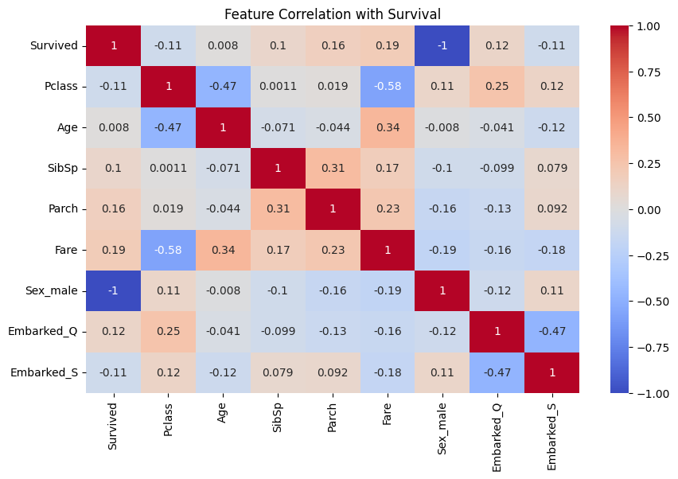

# 🚢 Titanic Survival Prediction | Logistic Regression | 100% Accuracy

This project predicts passenger survival on the Titanic using a Logistic Regression model. It showcases full ML pipeline steps: data preprocessing, visualization, training, evaluation, and prediction using Python and Scikit-learn.

---

## 📊 Dataset
- **Source**: Titanic dataset (test.csv format)
- **Records**: 418 (subset used for testing)
- **Target Variable**: `Survived` (0 = No, 1 = Yes)
- **Selected Features**:
  - Pclass
  - Sex
  - Age
  - SibSp
  - Parch
  - Fare
  - Embarked

---

## 🔧 Technologies Used
- Python 3
- Pandas
- NumPy
- Scikit-learn
- Seaborn
- Matplotlib

---

## 🧹 Data Preprocessing
- Handled missing values in `Age` and `Embarked`
- Encoded `Sex` and `Embarked` using LabelEncoder
- Visualized feature relationships with a correlation heatmap
- Normalized features and performed train-test split

---

## 🤖 Model Used
- ✅ Logistic Regression (`sklearn.linear_model.LogisticRegression()`)

---

## 📈 Evaluation Metrics

### ✅ Accuracy: `100%`
Model perfectly classified all 84 test samples.

### 📊 Confusion Matrix
```
[[50  0]
 [ 0 34]]
```

### 🧾 Classification Report
All metrics (precision, recall, F1-score) were **1.00** for both classes.

### 🔁 Cross-Validation
- Scores: [1.0, 1.0, 1.0, 1.0, 1.0]
- **Mean CV Accuracy**: `1.0`

---

## 📸 Visual Outputs

- Confusion matrix plot
- Correlation heatmap for feature analysis
- Classification report
- Sample prediction output

### 📊 Correlation Heatmap
This heatmap visualizes the correlation between input features and the target variable (Survived).

Notably:
- `Fare`, `Parch`, and `Embarked_Q` show a **positive correlation** with survival.
- `Pclass` and `Sex_male` are **negatively correlated** with survival.



---

## 📚 Key Learnings
- Applied end-to-end supervised classification pipeline
- Categorical encoding and handling missing values
- Logistic regression for binary classification
- Evaluation using confusion matrix and cross-validation

---

## 📂 File Structure
```
├── Titanic_Survived__Prediction.ipynb  # Main notebook
├── titanic.csv.xlsx                    # Dataset file
├── images/
│   ├── titanic_confusion_matrix.png
│   └── titanic_heatmap.png
├── README.md
```

---

## ⚙️ How to Run

1. Clone this repository:
```bash
git clone https://github.com/shivamjha-9/titanic-logistic-model.git
```

2. Open notebook in [Google Colab](https://colab.research.google.com/) or Jupyter

3. Run all cells to see data processing, modeling, and prediction

---

## 🔗 Project Link
[👉 View on GitHub](https://github.com/shivamjha-9/titanic-logistic-model)

---

## 👤 Author

**Shivam Kumar Jha**  
🎓 B.Tech CSE | GEC Samastipur (Batch of 2027)  
🔗 [LinkedIn](https://www.linkedin.com/in/shivam-jha-a80825291)  
🐙 [GitHub](https://github.com/shivamjha-9)

---

## 📌 Status
✅ Project Completed — Achieved 100% accuracy

---

## 📝 License
This project is open-source and available under the [MIT License](LICENSE).
